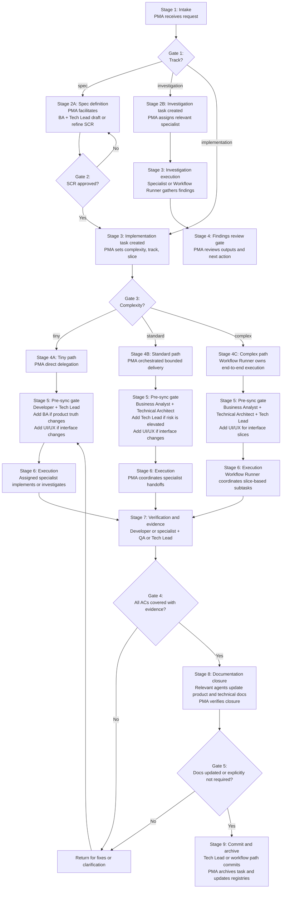

# NomadWorks

NomadWorks is an OpenCode plugin that installs a structured multi-agent workflow into a repository.

## Install

Add the plugin to your OpenCode config:

```json
{
  "$schema": "https://opencode.ai/config.json",
  "plugin": ["@neuralnomads/nomadworks"]
}
```

Then restart OpenCode and run `nomadworks_init` inside the target repository.

## Configure

Initialization creates `.codenomad/nomadworks.yaml`. NomadWorks reads this file for repository-local defaults, feature flags, and per-agent overrides.

Quick links:

- [Installation](docs/setup/INSTALLATION.md)
- [Configuration](docs/setup/CONFIGURATION.md)
- [Workflow Agents](docs/guides/AGENTS.md)
- [Workflow Model](docs/guides/WORKFLOW.md)
- [Documentation Structure](docs/core/documentation_structure.md)

## Workflow Agents

- `product_manager` (Product Manager Agent, PMA): Default orchestrator and routing agent.
- `workflow_runner` (Workflow Runner): Autonomous executor for complex implementation tasks.
- `business_analyst` (Business Analyst, BA): Requirements and product-truth steward.
- `technical_architect` (Technical Architect): Architecture, interfaces, and impact mapping.
- `tech_lead` (Tech Lead): Behavioral verification and technical sign-off.
- `developer` (Developer): Implementation and test authoring.
- `qa_engineer` (QA Engineer): Verification and test coverage.
- `reviewer` (Reviewer): Independent review.
- `ui_ux_designer` (UI/UX Designer): Visual and interaction review.

## Task Model

- **Complexity:** `tiny`, `standard`, `complex`
- **Track:** `implementation`, `investigation`, `spec`
- **Slice:** `foundation`, `core`, `logic`, `ui`, `polish`, `qa`, `docs`

Use `complex` for work that needs an approved SCR, slice-based decomposition, and `workflow_runner`. Keep `tiny` and `standard` tasks direct and bounded.

## What Is An SCR?

`SCR` stands for **Spec Change Request**.

An SCR is the workflow artifact used to define and approve a meaningful change before implementation starts. It records:

- the problem being solved
- the proposed specification change
- the intended implementation direction
- acceptance criteria
- review and approval state

NomadWorks uses SCRs so the team does not jump straight from a vague request into code. The SCR gives the Product Manager Agent, Business Analyst, Tech Lead, and other specialists a shared source of truth for what the change is supposed to achieve before delivery work begins.

In practice, SCRs help:

- reduce missed requirements and hidden assumptions
- separate proposed change from implemented truth
- make complex work reviewable before coding starts
- provide a stable anchor for decomposition into tasks

## Task Flow


```

## Parallelism

Until dedicated git worktree support lands, NomadWorks supports limited parallelism:

- one shared-worktree implementation task at a time
- parallel investigation and spec tasks when they avoid conflicting edits

For deeper workflow details, use the linked docs above.
